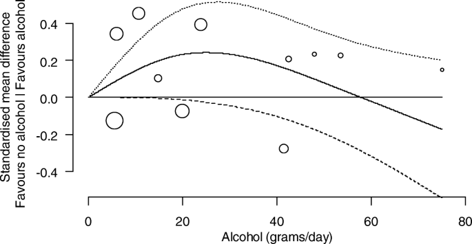
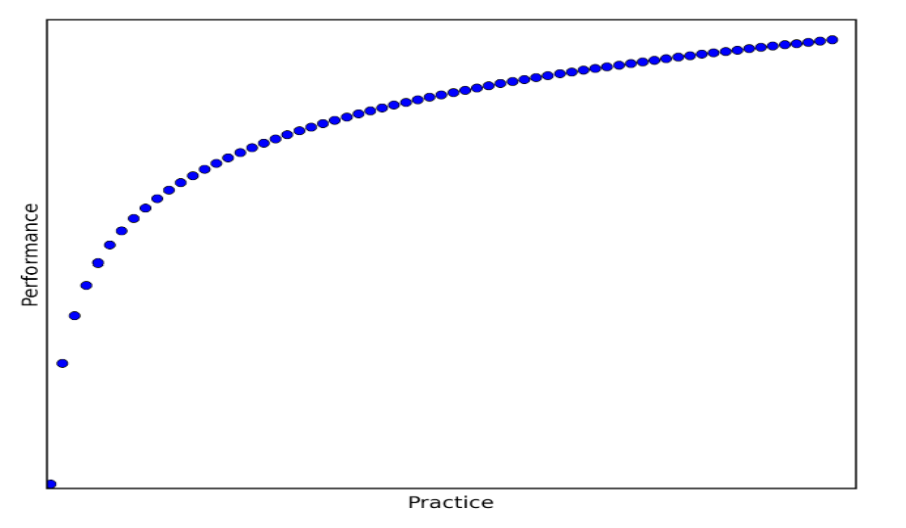
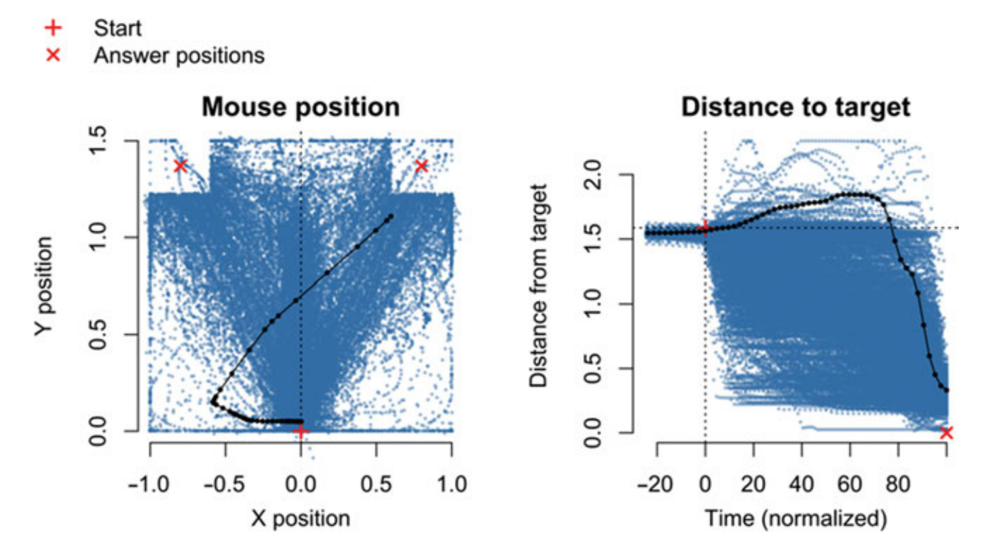
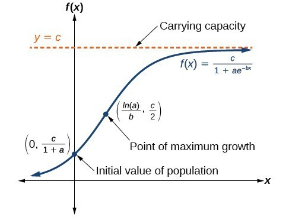

class: center
background-image: url("waves2.png")
background-size: contain
---

<style type="text/css">
body, td {
   font-size: 15px;
}
code.r{
  font-size: 15px;
}
pre {
  font-size: 20px
}
.huge .remark-code { /*Change made here*/
  font-size: 200% !important;
}
.tiny .remark-code { /*Change made here*/
  font-size: 80% !important;
}


</style>

## Press record

---

## Regression
Gaussian distribution:
$y_{i} \sim \mathcal{N^{iid}}(\mu_{i},\sigma)$ <br/> <br/>
$\mu_{i} = \alpha+\beta*x_i$ <br/><br/> 
Model mean and standard deviation <br/> <br/> 
<br/>
<br/>
a) Errors: $\mathcal{N}^{iid}(0,\sigma)$ <br/> <br/>
b) __Linearity__ and additivity <br/> <br/>
c) Validity <br/> <br/>
d) Lack of perfect multicolinearity <br/> <br/>

---

## Nonlinearity

Non-linear relationship between dependent and independent variables: <br/><br/>
J or quadratic relationship between concepts <br/>

```{r, echo=FALSE, out.width = '60%',fig.align='center'}

```

---

## Nonlinearity

Non-linear relationship between dependent and independent variables: <br/><br/>
Skill acquisition, loss of heating from heaters, and even loss memory over time <br/><br/>

```{r, echo=FALSE, out.width = '60%',fig.align='center'}

```

---

## Nonlinearity

Non-linear relationship between dependent and independent variables: <br/><br/>
No strong assumptions on the functional form of the curve <br/>

```{r, echo=FALSE, out.width = '80%',fig.align='center'}

```

---

## Methods to model nonlinearity

Polynomial regression <br/>

$y_i = \alpha+\beta_1*x_i+\beta_2*x_i^2+\beta_3*x_i^3+\epsilon_i$ <br/><br/>
 
Mathematical equations <br/>

$y_i = u-ax^c +\epsilon_i$ <br/><br/>

Generalized additive models

$y_i = \alpha + f(x) +\epsilon_i$ <br/><br/>

---

## Data

Lifespan changes in chess performance:

```{r,fig.width=14, fig.height=5, fig.align='center'}
chess<-read.table('ChessDevelopment.txt',sep='\t', header=T)
par(mfrow=c(1,1), bty='n',mar = c(5, 4, .1, .1), cex=1.1, pch=16)
plot(chess$Age, chess$Rating)
```

---

## Polynomial regression

$y_i = \alpha+\beta_1*x_i+\epsilon_i$

```{r}
lmLin<-lm(Rating~Age, data=chess)
summary(lmLin)
```

---

## Fitting the function: linear effect

```{r, fig.width=14, fig.height=5, fig.align='center'}
par(mfrow=c(1,1), bty='n',mar = c(5, 4, .1, .1), cex=1.1, pch=16)
plot(chess$Age, chess$Rating)
x=10:80
y=coefficients(lmLin)[1]+coefficients(lmLin)[2]*x
lines(x,y, col='red',lwd=3)
```
---

## Polynomial regression

$y_i = \alpha+\beta_1*x_i+\beta_2*x_i^2+\epsilon_i$

```{r}
lmQuad<-lm(Rating~poly(Age, degree=2, raw=T), data=chess)
summary(lmQuad)
```

---

## Fitting the function: Quadratic effect

```{r, fig.width=14, fig.height=5, fig.align='center'}
par(mfrow=c(1,1), bty='n',mar = c(5, 4, .1, .1), cex=1.1, pch=16)
plot(chess$Age, chess$Rating)
x=10:80
y=coefficients(lmQuad)[1]+coefficients(lmQuad)[2]*x+coefficients(lmQuad)[3]*x^2
lines(x,y, col='red',lwd=3)
```
---

## Polynomial regression

$y_i = \alpha+\beta_1*x_i+\beta_2*x_i^2+\beta_3*x_i^3+\epsilon_i$

```{r}
lmCub<-lm(Rating~poly(Age, degree=3, raw=T), data=chess)
summary(lmCub)
```

---

## Fitting the function: Cubic effect

```{r, fig.width=14, fig.height=5, fig.align='center'}
par(mfrow=c(1,1), bty='n',mar = c(5, 4, .1, .1), cex=1.1, pch=16)
plot(chess$Age, chess$Rating)
x=10:80
CubFit=coefficients(lmCub)[1]+coefficients(lmCub)[2]*x+coefficients(lmCub)[3]*x^2+coefficients(lmCub)[4]*x^3
lines(x,CubFit, col='red',lwd=3)
```

---

## Comparison of the model fit

```{r}
anova(lmLin,lmQuad,lmCub)
AIC(lmLin,lmQuad,lmCub)
```

---
## Mixed-effect polynomial: random intercept


```{css, echo=FALSE}
pre {
  max-height: 300px;
  overflow-y: auto;
}

pre[class] {
  max-height: 100px;
}
```

```{css, echo=FALSE}
.scroll-100 {
  max-height: 100px;
  overflow-y: auto;
  background-color: inherit;
}
```

```{r, warning=FALSE, message=FALSE}
require(lme4)
lmerCub<-lmer(Rating~poly(Age, degree=3, raw=T)+(1|Player), data=chess)
print(summary(lmerCub), cor=F)
```

---
## Cubic with random intercept

```{r , warning=FALSE, message=FALSE, fig.width=14, fig.height=5, fig.align='center'}
par(mfrow=c(1,1), bty='n',mar = c(5, 4, .1, .1), cex=1.1, pch=16)
plot(chess$Age, chess$Rating)
CubRint=fixef(lmerCub)[1]+fixef(lmerCub)[2]*x+fixef(lmerCub)[3]*x^2+fixef(lmerCub)[4]*x^3
lines(x,CubFit, col='red',lwd=3)
lines(x,CubRint, col='blue',lwd=3)
```

---
## Mixed-effect polynomial: random intercept and linear slope

```{r, warning=FALSE, message=FALSE, fig.width=14, fig.height=5, fig.align='center'}
lmerCub2<-lmer(Rating~poly(Age, degree=3, raw=T)+(1+Age|Player), data=chess)
par(mfrow=c(1,1), bty='n',mar = c(5, 4, .1, .1), cex=1.1, pch=16)
plot(chess$Age, chess$Rating)
CubRintlin=fixef(lmerCub2)[1]+fixef(lmerCub2)[2]*x+fixef(lmerCub2)[3]*x^2+fixef(lmerCub2)[4]*x^3
lines(x,CubFit, col='red',lwd=3)
lines(x,CubRint, col='blue',lwd=3)
lines(x,CubRintlin, col='green',lwd=3)
```
---
## Mathematical functions
Predefined functions - we have a strong assumption on the possible functional form of the data <br/>

Power-law learning curve: $y_i = u-ax^c +\epsilon_i$ <br/>

_u_ - upper limit (asymptote) <br/>
_a_ - difference initial performance from the upper limit <br/>
_c_ - learning rate (slope)  <br/>

```{r, echo=FALSE, out.width = '60%',fig.align='center'}

```

---

## Subsetting the data

Pre-peak increase: <br/>

```{r, fig.width=14, fig.height=5, fig.align='center'}
chess2<-chess[chess$Age<=35,]
par(mfrow=c(1,1), bty='n',mar = c(5, 4, .1, .1), cex=1.1, pch=16)
plot(chess2$Age, chess2$Rating)
```
---
## Power-law function

```{r}
u_init  <-  max(chess$Rating)*1.2 
a_init  <-  u_init
c_init  <-  -0.30
PowerLaw <- nls(Rating~u-a*(Age^c),start=list(u=u_init,a=a_init,c=c_init),data=chess2)
summary(PowerLaw)
```
---
## Power-law function: fit

```{r, fig.width=14, fig.height=5, fig.align='center'}
chessPred=data.frame(Age=10:35)
chessPred$Power=predict(PowerLaw, newdata = chessPred)
par(mfrow=c(1,1), bty='n',mar = c(5, 4, .1, .1), cex=1.1, pch=16)
plot(chess2$Age, chess2$Rating)
lines(chessPred$Age,chessPred$Power, col='red',lwd=3)
```

---

## Logistic growth model

Logistic growth model: $y_i = \frac{u}{1+a*e^{c*x}}$ <br/>

- $\frac{u}{1+a}$ - initial value
- u - the carrying capacity (asymptote)
- b - rate of growth (slope)

```{r, echo=FALSE, out.width = '50%',fig.align='center'}

```

---
## Logistic growth model

```{r , fig.width=14, fig.height=5, fig.align='center'}
LogGrowth<- nls(Rating ~ u / (1 + a*exp(c * Age)), start=list(u=1900,a=500,c=c_init), data=chess2)
summary(LogGrowth)
```

---

## Logistic growth: fit

```{r , fig.width=14, fig.height=5, fig.align='center'}
chessPred$Growth=predict(LogGrowth, newdata = chessPred)
par(mfrow=c(1,1), bty='n', mar = c(5, 4, .1, .1), cex=1.1, pch=16)
plot(chess2$Age, chess2$Rating)
lines(chessPred$Age, chessPred$Power, col='red', lwd=3)
lines(chessPred$Age,chessPred$Growth, col='blue',lwd=3)
```

---

## Model comparison

```{r}
AIC(PowerLaw, LogGrowth)
BIC(PowerLaw, LogGrowth)
```

---
## Mixed-effect power-law

```{r, warning=FALSE, message=FALSE}
power=deriv(~u-a*Age^c, namevec=c('u','a','c'), function.arg=c('Age','u','a','c'))
fit.power=nlmer(Rating ~ power(Age, u,a,c) ~ (u|Player),start=list(nlpars=c(u=2089.6297,a=51314.5703,c=-1.5527)),data=chess2)
summary(fit.power)
```
---

## Mixed-effect power-law: fit

```{r, fig.width=14, fig.height=5, fig.align='center'}
plot(chess2$Age, chess2$Rating)
PowerRU=1.848e+03-8.210e+04*chessPred$Age^-1.761e+00
lines(chessPred$Age,chessPred$Power, col='red',lwd=3)
lines(chessPred$Age,PowerRU, col='blue',lwd=3)
```
---

## Double exponential function

```{r}
nonlin <- function(t, a, b, c) { (a/b) * exp( -(t-c)/b - exp(-(t-c)/b) ) }
nlsfit <- nls(Rating ~ nonlin(Age, a, b, c), data=chess, start=list(a=2000, b=50, c=35))
summary(nlsfit)
```

---

## Double exponential: fit

```{r, fig.width=14, fig.height=5, fig.align='center'}
chessPred2=data.frame(Age=10:80)
chessPred2$DoubleExp=predict(nlsfit, newdata=chessPred2)
plot(chess$Age, chess$Rating)
lines(chessPred2$Age,chessPred2$DoubleExp, col='red',lwd=3)
```
---
## Generalized additive models (GAMs)

We do not have to specify a function, GAM determines it using the data <br/> <br/>
GAM is trying to optimize the smooth function that describes the relationship between the predictor and dependent variable: <br/>

$y_i = \alpha + f(x) +\epsilon_i$ <br/><br/>

```{r, echo=FALSE, out.width = '60%',fig.align='center'}

```

---

## GAM model

```{r, warning=FALSE, message=FALSE}
require(mgcv)
gam1<-gam(Rating~s(Age, bs='cs'), data=chess)
summary(gam1)
```

---

## GAM model: fit

```{r , fig.width=14, fig.height=5, fig.align='center', warning=FALSE, message=FALSE}
require(itsadug)
plot_smooth(gam1, view='Age', rm.ranef=F)
```

---

## Nonlinear interactions

```{r, fig.width=14, fig.height=5, fig.align='center', warning=FALSE, message=FALSE}
gam2<-gam(Rating~te(Age,Stale), data=chess)
fvisgam(gam2, view=c('Age','Stale'), rm.ranef = F, too.far = .1)
```

---

## Tutorials

For further reading check: 
- Data Analysis Using Regression and Multilevel/Hierarchical Models" by Andrew Gelman and Jennifer Hill <br/><br/>

- van Rij, J., Vaci, N., Wurm, L. H., & Feldman, L. B. (2020). Alternative quantitative methods in psycholinguistics: Implications for theory and design. Word knowledge and word usage: A cross-disciplinary guide to the mental lexicon, 83-126.

- Tutorial by Jacolien Van Rij: https://jacolienvanrij.com/Tutorials/GAMM.html

---

# Thank you for your attention
